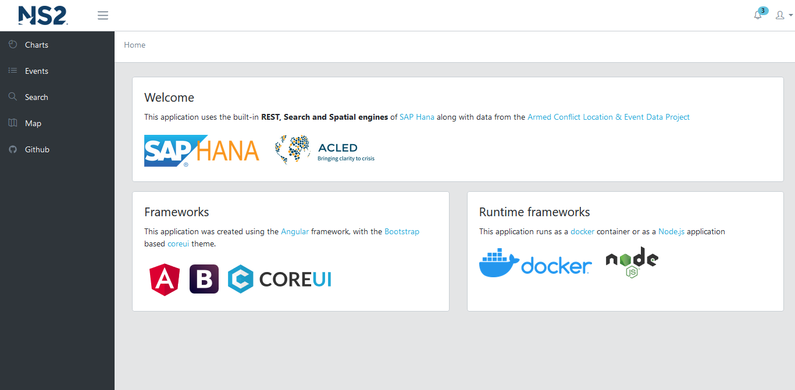
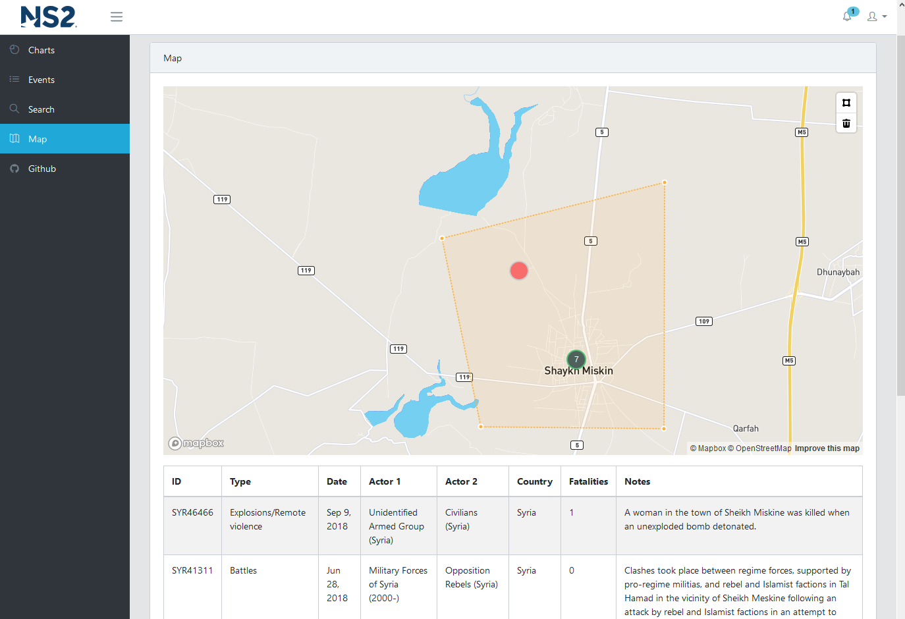
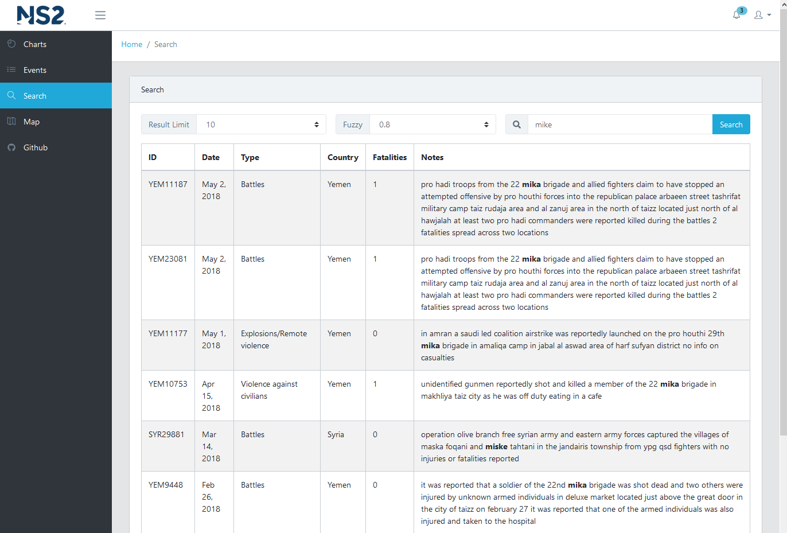
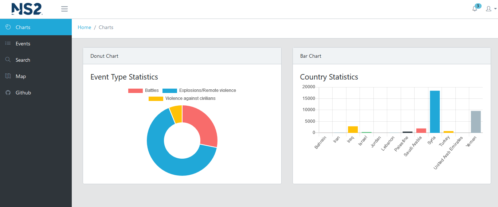
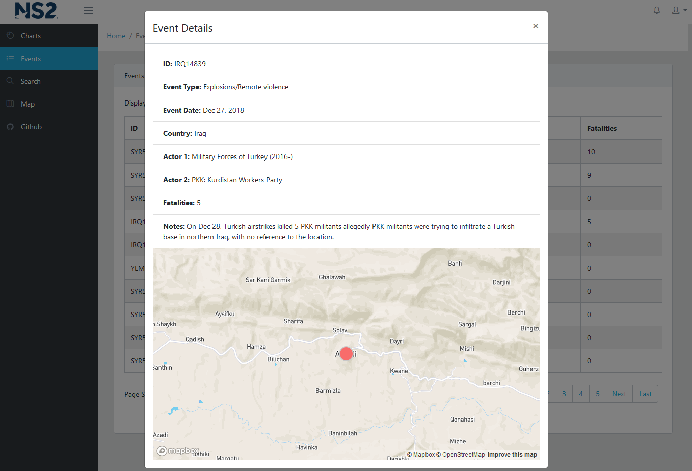

# HXE Angular

Client appliation for [SAP HANA](https://www.sap.com/products/hana.html) services that taking advantage of the built-in REST, Search and Spatial engines. The backend project is located at [github/mechevarria/hxe_mta](https://github.com/mechevarria/hxe_mta). This project was generated with [Angular CLI](https://github.com/angular/angular-cli). [CoreUI](https://coreui.io/docs/getting-started/introduction/) is already integrated.  The project is configured to run as a [docker](https://docs.docker.com/install/) container. Data is provided by the [Armed Conflict Location & Event Data](https://www.acleddata.com) project

 
#
 
#
 
#
 
#
 

## Run in production mode as a docker container

* Build the multistage image with this script

> `docker-build.sh`

*  In order for the following script to run, two environment variables to be set `HXE_HOST` and `HXE_PORT`, which is the host and port of the [HANA REST service api](https://github.com/mechevarria/hxe_mta) Example: `HXE_HOST=192.168.56.101` and `HXE_PORT=51006`

* Run the nginx continer with this script

> `docker-run.sh`  

## Local Install

* Install dependencies with 
>`npm install`

## Development

* In one terminal, start a dev build that watches source files and rebuilds automatically

> `npm run watch`

* In a separate terminal, create the development [nginx](https://www.nginx.com/) container. This only needs to be done **once** for development.

  *  In order for the following script to run, two environment variables to be set `HXE_HOST` and `HXE_PORT`, which is the host and port of the [HANA REST service api](https://github.com/mechevarria/hxe_mta) Example: `HXE_HOST=192.168.56.101` and `HXE_PORT=51006`

> `docker-nginx.sh`

* After the image is built, run the nginx container with

> `docker-dev.sh`

The nginx server will be running on [https://localhost](https://localhost)

Whenever you make code changes the `watch` task will automatically rebuild and the changes reflected on the running nginx web server.

## Code scaffolding

* Run `ng generate component component-name` to generate a new component. You can also use `ng generate directive|pipe|service|class|guard|interface|enum|module`.

## Build

* Run `npm run build` to build the project. The build artifacts will be stored in the `dist/` directory.

## Further help

To learn more about SAP HANA development capabilities, go to [developers.sap.com](https://developers.sap.com/)

To learn about the docker configuration go to the [docker docs](https://docs.docker.com/)

To get more help on the Angular CLI use `ng help` or go check out the [Angular CLI README](https://github.com/angular/angular-cli/blob/master/README.md).

To get started with Angular, this is an excellent official [tutorial](https://angular.io/tutorial)

Mapbox component provided by [ngx-mapbox-gl](https://github.com/Wykks/ngx-mapbox-gl)

Bootstrap components were created using [ngx-bootstrap](https://github.com/valor-software/ngx-bootstrap)

Chart library by [ng2-charts](https://valor-software.com/ng2-charts/)

Notifications done with [angular-notifier](https://github.com/dominique-mueller/angular-notifier)
